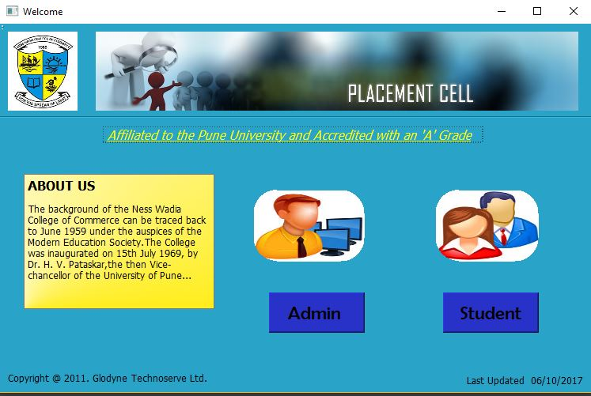
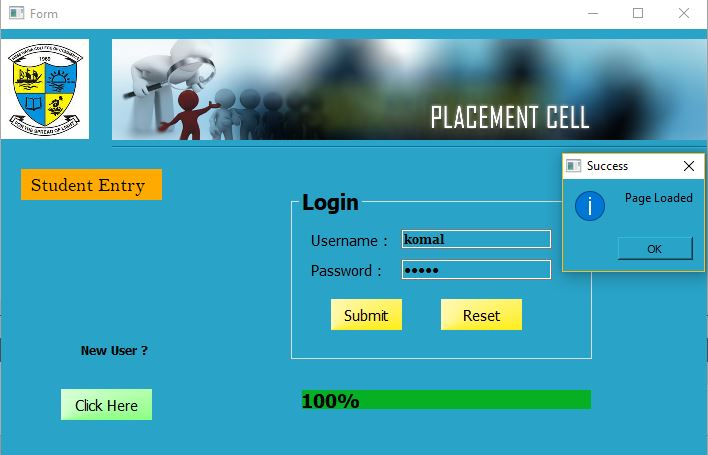
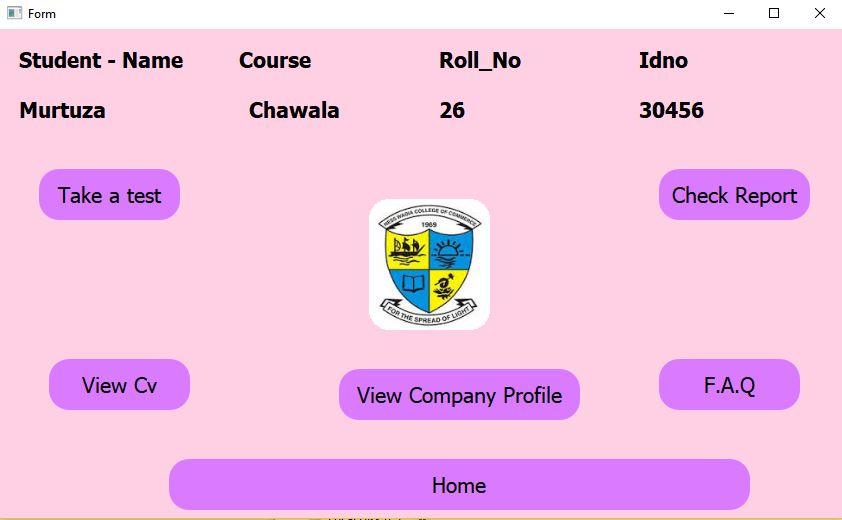
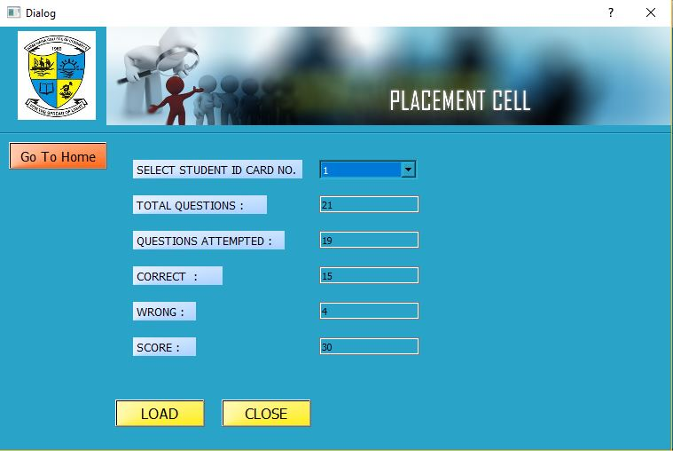
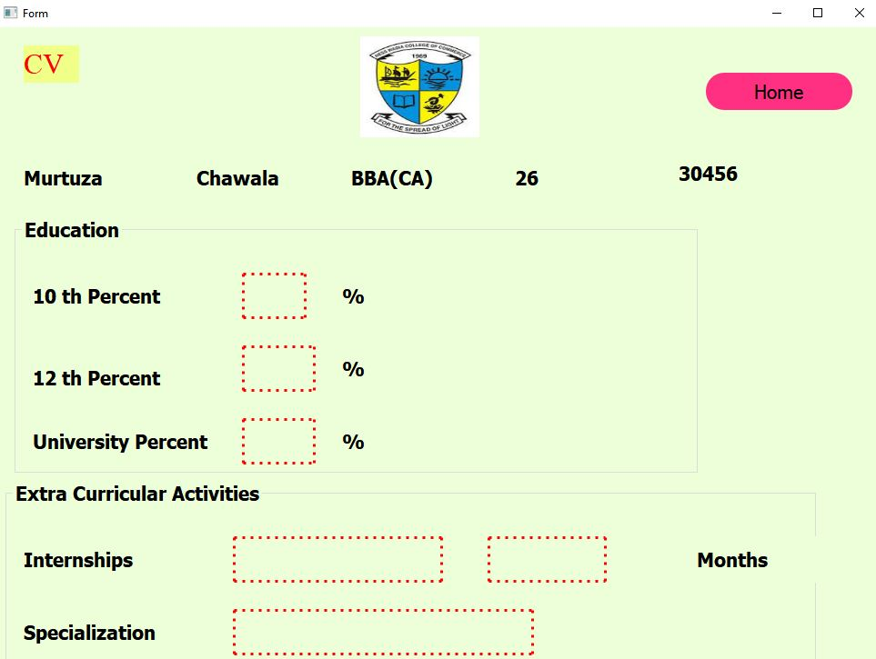
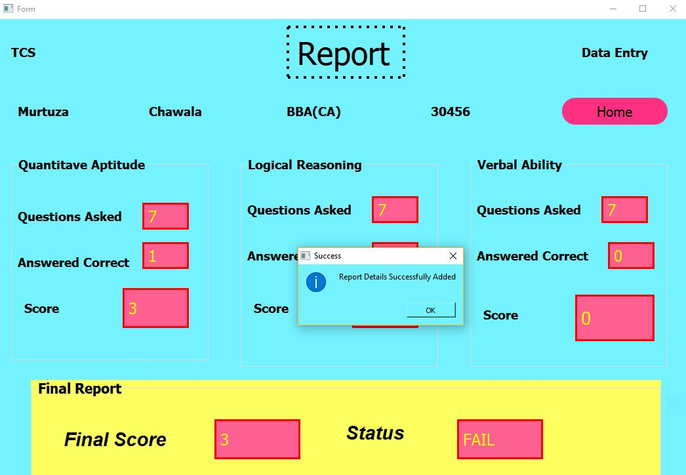

# Aptitude-Test-System-using-C++(Qt)-

#### A Mini Project which conducts aptitude test for students,generates CV,gives the result,provides admin functionalites and a lot more.

##### Some of the screenshots of the system

